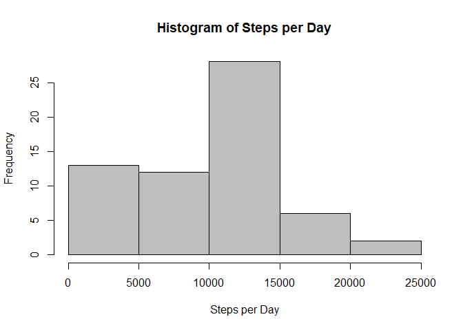
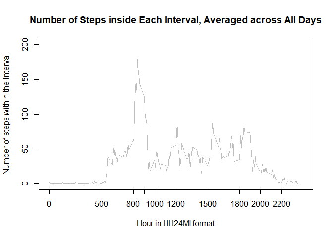
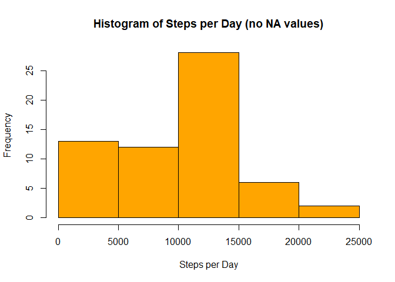
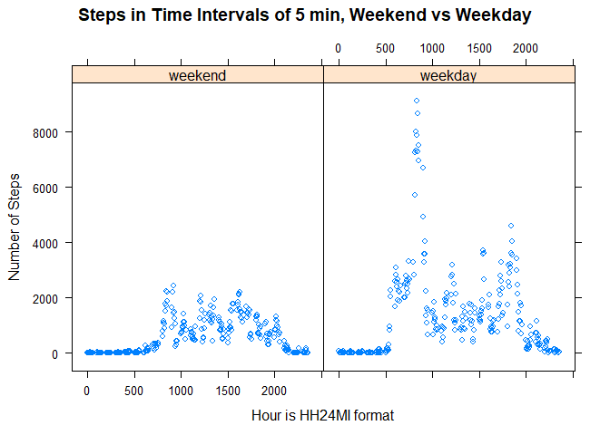

### Download the file and read the data into a structure (item #1)


```r
setwd("D:/Github/ReproducibleResearchWeek2/")
fileURL <- "https://d396qusza40orc.cloudfront.net/repdata%2Fdata%2Factivity.zip"
download.file(fileURL,"data.zip")
unzip("data.zip")
tbl1 <- read.table("activity.csv",sep=",",na.strings="NA",skip=1,col.names=c("Steps","Date","Interval"))
```

### Review the data


```r
dim(tbl1)
```

```
## [1] 17568     3
```

```r
head(tbl1)
```

```
##   Steps       Date Interval
## 1    NA 2012-10-01        0
## 2    NA 2012-10-01        5
## 3    NA 2012-10-01       10
## 4    NA 2012-10-01       15
## 5    NA 2012-10-01       20
## 6    NA 2012-10-01       25
```

```r
str(tbl1)
```

```
## 'data.frame':	17568 obs. of  3 variables:
##  $ Steps   : int  NA NA NA NA NA NA NA NA NA NA ...
##  $ Date    : Factor w/ 61 levels "2012-10-01","2012-10-02",..: 1 1 1 1 1 1 1 1 1 1 ...
##  $ Interval: int  0 5 10 15 20 25 30 35 40 45 ...
```

Next step: Generate the first aggregate


```r
per_day <- tbl1 %>% group_by(Date) %>% summarise(tot_step = sum(Steps,na.rm=TRUE))
dim(per_day)
```

```
## [1] 61  2
```

```r
sum(per_day$tot_step,na.rm=TRUE)
```

```
## [1] 570608
```


Then generate the plot and calculate median and average (item #2)

```r
hist(x=per_day$tot_step,col="grey",xlab="Steps per Day",main="Histogram of Steps per Day")
```

<!-- -->

```r
avg_steps <- round(sum(per_day$tot_step,na.rm=TRUE)/nrow(per_day),digits=0)
median_steps <- median(per_day$tot_step,na.rm=TRUE)
```
Print out the Average and the Median (item #3)

The Median steps per day is 10395 and the average steps per day is 9354

For the time series plot, we need to calculate the average number of steps taken in each 5-minute interval, across all days (item #4)


```r
ave_int <- tbl1 %>% group_by(Interval) %>% summarise(int_steps = sum(Steps,na.rm=TRUE))
dim(ave_int)
```

```
## [1] 288   2
```

```r
#head(ave_int)
#write.csv(ave_int,"ave_int.csv")
# Divide the sum of steps in each interval by the number of days to get the average
ave_int$int_steps = ave_int$int_steps/nrow(per_day)
# Find the max number of steps found in an interval to adjust the axis of the plot
max(ave_int$int_steps)
```

```
## [1] 179.1311
```

```r
plot(ave_int$Interval,
     ave_int$int_steps,
     type="l",
     col="grey",
     xlim=c(0,2400),
     ylim=c(0,200),
     xlab="Hour in HH24MI format",
     ylab="Number of steps within the Interval",
     main="Number of Steps inside Each Interval, Averaged across All Days"
     )
# Add custom ticks to demonstrate activity variations during the day
ticks = c(0000, 0800, 0900,1000, 1200,1500,1800,2000,2200)
axis(side = 1, at = ticks)
axis(side = 2)
```

<!-- -->

**According to the graph, the maximum activity is recorded between 8 - 9 am (item #5)**

Imputing missing values:

```r
pnull <- sum(is.na(tbl1$Steps))
```

Note: There is a total of 2304 NULL values in the dataset

Using [function tidyr::fill](https://tidyr.tidyverse.org/reference/fill.html) we will create a dataset that does not have NULL values (item #6)  

**Note**: we run the function twice. The first time, the value for the NULL interval will inherit the value   of the previous time interval. The second pass, (since the first pass left some NULL values) will work the opposite way, and fill the missing values with the ones coming after them.


```r
res1 <- tbl1 %>% fill(Steps,.direction="up")
tbl_nonull <- res1 %>% fill(Steps,.direction="down")
pnull2 <- sum(is.na(tbl_nonull$Steps))
```

Now we see that the number of NULL values in the new dataset is 0

We calculate again the number of total steps per day:


```r
per_day_nonull <- tbl_nonull %>% group_by(Date) %>% summarise(tot_step = sum(Steps))
#sum(per_day_nonull$tot_step,na.rm=TRUE)
```

and we proceed to perform the new plot, without any missing values (item #7) 


```r
hist(x=per_day_nonull$tot_step,col="orange",xlab="Steps per Day",main="Histogram of Steps per Day (no NA values)")
```

<!-- -->

```r
avg_steps_nonull <- round(sum(per_day_nonull$tot_step)/nrow(per_day),digits=0)
median_steps_nonull <- median(per_day_nonull$tot_step)
```

So now the new average is 9354 while initially it was 9354 and for the median we have new value 10395 as opposed to the original one 10395. 

How is it possible that there is no difference? By examining the original dataset we see that NA values are always before and after zero values. This means that the function merely replaced the NA value with 0


```r
# Create the factor and grouped the days into 2 categories, weekend and weekday
tbl_nonull$Date <- as.Date(tbl_nonull$Date)
weekend1 <- c("sobota","neděle") # Saturday and Sunday in Czech
tbl_nonull$Wday <- factor((weekdays(tbl_nonull$Date) %in% weekend1),
                          levels=c(TRUE,FALSE),
                          labels=c("weekend","weekday"))
```

Now that the dataset contrains the factor, it is time to create the final aggregate, which is group intervals of all weekend and all weekdays.


```r
tbl_ag_wd <- tbl_nonull %>% group_by(Interval,Wday) %>% summarise(tot_steps = sum(Steps))
```
And the plot of the two panels (total steps in weekdays vs weekend)


```r
library(lattice)
xyplot(tot_steps~Interval|factor(Wday),data=tbl_ag_wd,
       main="Steps in Time Intervals of 5 min, Weekend vs Weekday",
       xlab="Hour is HH24MI format",
       ylab="Number of Steps")    
```

<!-- -->
