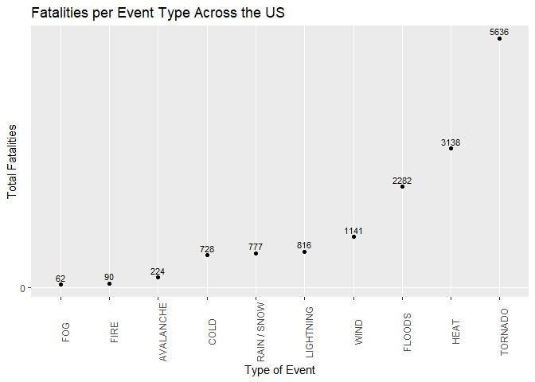
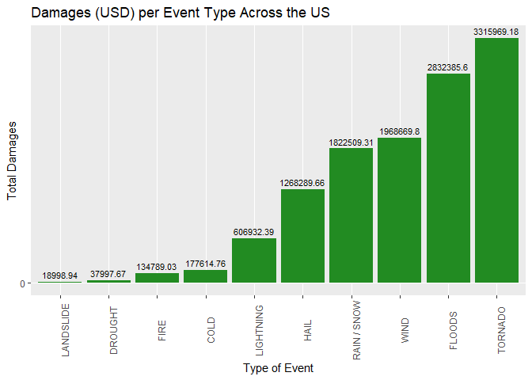
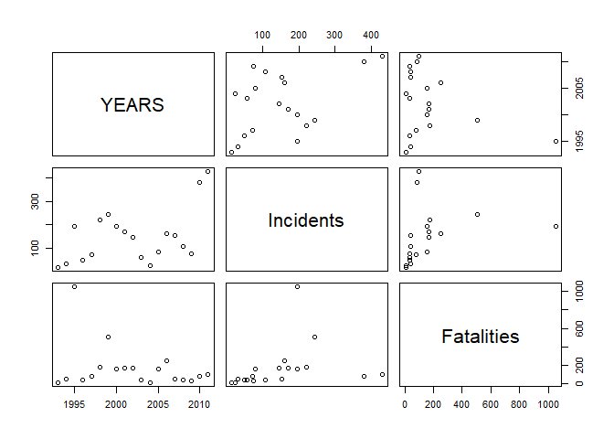

## Synopsis
This report examines a set of data from the NOAA storm database. Event types are groupped to display trends, and the most harmful events in terms of life and property are displayed in graphics and tabular data reports. 


## Data Processing

```r
setwd("D:/Github/Nikolas")
fileURL <- "https://d396qusza40orc.cloudfront.net/repdata%2Fdata%2FStormData.csv.bz2"
download.file(fileURL,"stormdata.bz2")
NOAADB <- read.csv("stormdata.bz2",stringsAsFactors = FALSE)
```

The data source is an excerpt from the [NOAA Storm Database](https://www.ncdc.noaa.gov/stormevents/). It will be mentioned in the rest of the document as "the database"

### Validation of the Data - Latitude/Longitude and US state
The code below was used to identify valid US state codes (Continental 50 + Hawaii), since there is a much larger number of unique entries for 'STATE' in the database.  
**The state codes below do not point to a valid state name:**

```r
#Function below will return all non-valid state code entries
StateName <- function(a) {
    b <- state.name[match(a,state.abb)]
    ifelse (is.na(b),a,b)
    }
res <- subset(NOAADB,StateName(NOAADB$STATE)==NOAADB$STATE)
unique(res$STATE)
```

```
##  [1] "DC" "PR" "ST" "AS" "GU" "MH" "VI" "AM" "LC" "PH" "GM" "PZ" "AN" "LH"
## [15] "LM" "LE" "LS" "SL" "LO" "PM" "PK" "XX"
```

**Geo Coordinates**
There are events with no LAT/LON coordinates, but worse the LONGITUDE contains a single negative value which resolves to state wth code "GU" and a number of positive values. In order for a map plot to take place it would make sense to take the following assumptions:  
LATITUDE: Needs to be divided by 100 to provide a correct value, and further assumption that in that case the format will be decimal degrees (and not degrees/minutes)  
LONGITUDE: All values are to assumed to be multiplied by -1 to become negative and divided by 100 to provide decimal degrees format (as with LATITUDE) 


```r
##str(NOAADB)
n_evt <- nrow(NOAADB)
n_ev_type <- unique(NOAADB$EVTYPE)
count_type <- length(n_ev_type)
```

The data provided contains **902297 events**, categorised into **985 levels**. Those are the different types of calamities encountered. The data source also contains such information as Begin and End Date/Time/Location, number of Fatalities, number of Injuries and the amount of Damage in Property and Crops.  

In this research, three different findings will be presented:  

1) The top ten types of incident that has been more harmful, in terms of both human life and financial damages
2) The top ten isolated incidents that has caused the most harm, in terms of human life and financial damages
3) A detailed review of a specific event (Heat)

To assess the most harmful events in terms of human life, a data frame was created, groupping the data source by event type, and summing the equivalent fields of Property and Crops damage in the database. 


```r
library (dplyr)
library(ggplot2)
library(lubridate)
```
Conversion of Date fields:  
We need to convert the date fields from factors to date format, so we can perform comparisons and filtering based on ranges. First we need to only keep the date part, as each entry has a trailing hours value that is always set at midnight.


```r
#Extract the time entry, keep just month/day/year
NOAADB$BGN_DATE <- sub(" .*","",NOAADB$BGN_DATE)
NOAADB$END_DATE <- sub(" .*","",NOAADB$END_DATE)
NOAADB$BGN_DATE <- as.Date(NOAADB$BGN_DATE,"%m/%d/%Y")
NOAADB$END_DATE <- as.Date(NOAADB$END_DATE,"%m/%d/%Y")
#Display earliest recorded incident
min(NOAADB$BGN_DATE)
```

```
## [1] "1950-01-03"
```

```r
#Store the year as a different column in our dataset
NOAADB$YEARS <- year(ymd(NOAADB$BGN_DATE))
#Gather some basic information, such as earliest/latest recording of an event, its total occurences, maximum cost in human life and economics
```
Having fixed the date fields, next step is to gather some basic information, such as earliest/latest recording of an event, its total occurences, maximum cost in human life and economics


```r
inf <- NOAADB %>% 
    group_by(EVTYPE) %>% 
    summarize(number=n(),max_fatal=max(FATALITIES),tot_fatal=sum(FATALITIES),min(BGN_DATE),max(BGN_DATE))
# Order by Most Lethal Incident
inf[order(-inf[3]),]
```

```
## # A tibble: 985 x 6
##    EVTYPE        number max_fatal tot_fatal `min(BGN_DATE)` `max(BGN_DATE)`
##    <chr>          <int>     <dbl>     <dbl> <date>          <date>         
##  1 HEAT             767       583       937 1993-08-03      2011-11-15     
##  2 TORNADO        60652       158      5633 1950-01-03      2011-11-21     
##  3 EXCESSIVE HE~   1678        99      1903 1994-06-27      2011-09-12     
##  4 EXTREME HEAT      22        57        96 1994-06-01      1995-11-01     
##  5 HEAT WAVE         74        33       172 1994-06-14      1998-08-22     
##  6 TSUNAMI           20        32        33 2006-09-28      2011-03-11     
##  7 UNSEASONABLY~     13        29        29 1995-08-01      1999-07-31     
##  8 TORNADOES, T~      1        25        25 1993-03-12      1993-03-12     
##  9 TROPICAL STO~    690        22        58 1993-01-04      2011-09-04     
## 10 FLASH FLOOD    54277        20       978 1993-01-04      2011-11-29     
## # ... with 975 more rows
```

```r
#And display by number of total fatalities
inf[order(-inf[4]),]
```

```
## # A tibble: 985 x 6
##    EVTYPE        number max_fatal tot_fatal `min(BGN_DATE)` `max(BGN_DATE)`
##    <chr>          <int>     <dbl>     <dbl> <date>          <date>         
##  1 TORNADO        60652       158      5633 1950-01-03      2011-11-21     
##  2 EXCESSIVE HE~   1678        99      1903 1994-06-27      2011-09-12     
##  3 FLASH FLOOD    54277        20       978 1993-01-04      2011-11-29     
##  4 HEAT             767       583       937 1993-08-03      2011-11-15     
##  5 LIGHTNING      15754         5       816 1993-01-03      2011-11-21     
##  6 TSTM WIND     219940        11       504 1955-02-01      2006-09-30     
##  7 FLOOD          25326        15       470 1993-01-01      2011-11-30     
##  8 RIP CURRENT      470         6       368 1994-06-10      2011-11-26     
##  9 HIGH WIND      20212         8       248 1993-01-01      2011-11-30     
## 10 AVALANCHE        386         6       224 1993-01-01      2011-11-13     
## # ... with 975 more rows
```

### Key Early Findings
1) Groupping the Event Type by categories of similar incidents would yield more meaningful numbers.
2) While some categories have many decades of data (TORNADO, TSTM WIND), others have not have records until almost 4 decades later. So attempting a comparison of the human and financial damages between such categories may not provide realistic information.

### Data Processing Continued - Groupping Events into Categories  


```r
# Convert factor to char to avoid error message "invalid factor level, NA generated"
NOAADB$EVTYPE <- as.character(NOAADB$EVTYPE)

#Define the group patterns
category_HEAT <- c("HEAT","WARMTH","HIGH TEMPERATURE")
category_COLD <- c("COLD","LOW TEMPERATURE","WINTER")
category_FLOODS <- c("FLOOD","CURRENT","SURF","STREAM")
category_RAIN_SNOW <- c("RAIN","SNOW","STORM","BLIZZARD")
category_WIND <- c("WIND","HURRICANE")
category_FIRE <- c("FIRE")
category_TORNADO <- c("TORNADO","FUNNEL")

#Collect all values
matches <- unique(grep(paste(category_HEAT,collapse="|"),NOAADB$EVTYPE,value=TRUE))
#For example, for the "HEAT" category, all the different event types below will be groupped into one:  
matches
```

```
##  [1] "HEAT"                     "RECORD HIGH TEMPERATURE" 
##  [3] "HIGH TEMPERATURE RECORD"  "RECORD HIGH TEMPERATURES"
##  [5] "RECORD WARMTH"            "EXTREME HEAT"            
##  [7] "EXCESSIVE HEAT"           "RECORD HEAT"             
##  [9] "HEAT WAVE"                "DROUGHT/EXCESSIVE HEAT"  
## [11] "RECORD HEAT WAVE"         "RECORD/EXCESSIVE HEAT"   
## [13] "HEAT WAVES"               "HEAT WAVE DROUGHT"       
## [15] "HEAT/DROUGHT"             "HEAT DROUGHT"            
## [17] "ABNORMAL WARMTH"          "UNUSUAL WARMTH"          
## [19] "UNUSUAL/RECORD WARMTH"    "PROLONG WARMTH"          
## [21] "EXCESSIVE HEAT/DROUGHT"
```

```r
#Replace with a single value in the group                  
NOAADB$EVTYPE[NOAADB$EVTYPE %in% matches] <- "HEAT"

#Repeat for all groups
matches <- unique(grep(paste(category_COLD,collapse="|"),NOAADB$EVTYPE,value=TRUE))
NOAADB$EVTYPE[NOAADB$EVTYPE %in% matches] <- "COLD"

matches <- unique(grep(paste(category_FLOODS,collapse="|"),NOAADB$EVTYPE,value=TRUE))
NOAADB$EVTYPE[NOAADB$EVTYPE %in% matches] <- "FLOODS"

matches <- unique(grep(paste(category_RAIN_SNOW,collapse="|"),NOAADB$EVTYPE,value=TRUE))
NOAADB$EVTYPE[NOAADB$EVTYPE %in% matches] <- "RAIN / SNOW"

matches <- unique(grep(paste(category_WIND,collapse="|"),NOAADB$EVTYPE,value=TRUE))
NOAADB$EVTYPE[NOAADB$EVTYPE %in% matches] <- "WIND"

matches <- unique(grep(paste(category_FIRE,collapse="|"),NOAADB$EVTYPE,value=TRUE))
NOAADB$EVTYPE[NOAADB$EVTYPE %in% matches] <- "FIRE"

matches <- unique(grep(paste(category_TORNADO,collapse="|"),NOAADB$EVTYPE,value=TRUE))
NOAADB$EVTYPE[NOAADB$EVTYPE %in% matches] <- "TORNADO"

# This also works: filter(stdata,grepl(paste(cat_HEAT,collapse = "|"),EVTYPE)) but how to store back to the df
# Next, prepare for two tables, most lethal incident and incident type with most fatalities
inf <- NOAADB %>% 
    group_by(EVTYPE) %>% 
    summarize(INCIDENTS=n(),FATALITIES_BY_INCIDENT=max(FATALITIES),TOTAL_FATALITIES=sum(FATALITIES))
```

### Most Lethal Incident, based on number of Fatalities and its Type

```r
# Order by Most Lethal Incident
inf[order(-inf[3]),]
```

```
## # A tibble: 424 x 4
##    EVTYPE                  INCIDENTS FATALITIES_BY_INCIDE~ TOTAL_FATALITIES
##    <chr>                       <int>                 <dbl>            <dbl>
##  1 HEAT                         2818                   583             3138
##  2 TORNADO                     67675                   158             5636
##  3 TSUNAMI                        20                    32               33
##  4 UNSEASONABLY WARM AND ~        13                    29               29
##  5 WIND                       254031                    25             1141
##  6 RAIN / SNOW                145611                    22              777
##  7 FLOODS                      87897                    20             2282
##  8 COLD                        22021                    14              728
##  9 FIRE                         4240                    14               90
## 10 LANDSLIDE                     600                    14               38
## # ... with 414 more rows
```

### Incident Group responsible for the biggest number of Fatalities

```r
#And display by number of total fatalities
inf[order(-inf[4]),]
```

```
## # A tibble: 424 x 4
##    EVTYPE      INCIDENTS FATALITIES_BY_INCIDENT TOTAL_FATALITIES
##    <chr>           <int>                  <dbl>            <dbl>
##  1 TORNADO         67675                    158             5636
##  2 HEAT             2818                    583             3138
##  3 FLOODS          87897                     20             2282
##  4 WIND           254031                     25             1141
##  5 LIGHTNING       15754                      5              816
##  6 RAIN / SNOW    145611                     22              777
##  7 COLD            22021                     14              728
##  8 AVALANCHE         386                      6              224
##  9 FIRE             4240                     14               90
## 10 FOG               538                     11               62
## # ... with 414 more rows
```

From the numbers above, it can be seen that:  
1) TORNADO has the highest number of fatalities in total, but the recorded dates of such events far exceed the dates of others. There are tornadoes recorded as far back as 1950, while events related to high temperature have not been recorded before 1993.  
2) **HEAT comes out with the most lethal event (583 fatalities)** in the entire database, second highest total cause of loss of life in the database, and this, even with reocords appear after 1993.

### Plot for the Top 10 fatality causes

```r
res_all <- NOAADB %>% group_by(EVTYPE) %>%
    summarise(Fatalities=sum(FATALITIES))
#order by fatalities
res_all_ordered <- res_all[order(-res_all[2]),]
#keep Top 10
res_all_ordered <- res_all_ordered[1:10,]


ggplot(aes(x=reorder(EVTYPE,Fatalities),y=Fatalities),data=res_all_ordered) +
    geom_point()+
    scale_y_continuous(breaks=0) +
    labs(title="Fatalities per Event Type Across the US",x="Type of Event",y="Total Fatalities")+
    geom_text(aes(label=Fatalities),color="black",size=3,vjust=-0.5)+
    theme(axis.text.x=element_text(angle=90))
```

<!-- -->
  
### Top 10 most Expensive Event Types in terms of Property and Crops Loss


```r
res_all <- NOAADB %>% group_by(EVTYPE) %>%
    summarise(Damages=sum(PROPDMG+CROPDMG))
#order by Damages
res_all_ordered <- res_all[order(-res_all[2]),]
#keep Top 10
res_all_ordered <- res_all_ordered[1:10,]


ggplot(aes(x=reorder(EVTYPE,Damages),y=Damages),data=res_all_ordered) +
    geom_bar(stat="identity",fill = "forestgreen")+
    scale_y_continuous(breaks=0) +
    labs(title="Damages (USD) per Event Type Across the US",x="Type of Event",y="Total Damages")+
    geom_text(aes(label=Damages),color="black",size=3,vjust=-0.5)+
    theme(axis.text.x=element_text(angle=90))
```

<!-- -->
  
### Geographical distribution of Events
In this section, we group events ordered by the frequency of different US states they appear in. Events impacting the largest number of states are on top.  


```r
res <- subset(NOAADB,StateName(NOAADB$STATE)!=NOAADB$STATE)
res <- res %>% group_by(EVTYPE) %>% summarise(n=length(unique(STATE)))
res[order(-res[2]),]
```

```
## # A tibble: 409 x 2
##    EVTYPE          n
##    <chr>       <int>
##  1 COLD           50
##  2 FLOODS         50
##  3 HAIL           50
##  4 LIGHTNING      50
##  5 RAIN / SNOW    50
##  6 TORNADO        50
##  7 WIND           50
##  8 HEAT           49
##  9 DROUGHT        47
## 10 FIRE           43
## # ... with 399 more rows
```

### The case of Heat

The following plot displays the HEAT related incidents through the years. What clearly stands out is the 1995 peak from Heat related deaths. This is a known and documented event, and more information can be found [in this Wikipedia Article](1995_Chicago_heat_wave). Also another "positive" trend is that while the number of heat incidents rises (as anticipated through the Global Warming phenomenon) the number of casualities from heat decreases.


```r
heat <- subset(NOAADB,EVTYPE=="HEAT")
heat_year <- heat %>%
    group_by(YEARS) %>% summarize(Incidents=n(),Fatalities=sum(FATALITIES))
#The data
heat_year
```

```
## # A tibble: 19 x 3
##    YEARS Incidents Fatalities
##    <dbl>     <int>      <dbl>
##  1  1993        17          7
##  2  1994        33         44
##  3  1995       195       1051
##  4  1996        50         36
##  5  1997        73         81
##  6  1998       220        173
##  7  1999       243        502
##  8  2000       195        158
##  9  2001       170        166
## 10  2002       146        167
## 11  2003        59         36
## 12  2004        27          6
## 13  2005        82        158
## 14  2006       162        252
## 15  2007       154         44
## 16  2008       109         42
## 17  2009        76         33
## 18  2010       379         83
## 19  2011       428         99
```

```r
#And the plot
plot(heat_year)
```

<!-- -->

## Results
All of the world,environment and the climate have undergone drastic changes from the early dates of this report until its latest. Technology has certainly helped avoid some types of natural disasters and help against climate extremes, but itself, with its large energy footprint may also be attributed as a main contributor to said environmental changes. While the database covers far too many decades to be able to draw a singular conclusion, it can be seen that even a large geographical area as the Continental US has common issues among its many regions. Numbers that were a surprise were how Heat far outnumbers Cold in terms of fatalities and Injuries, and how Heat in total is a very large contributor to extreme events. 
